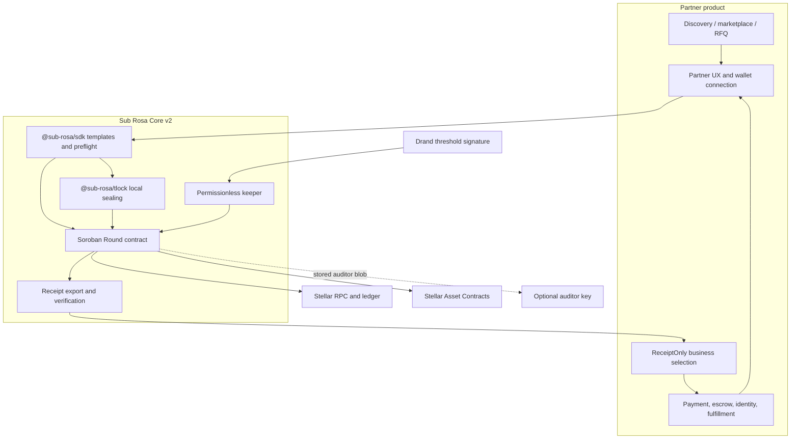
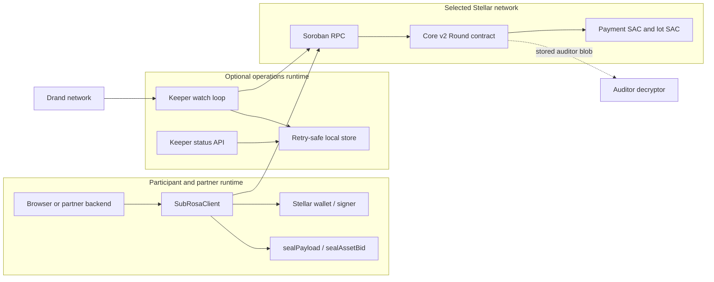
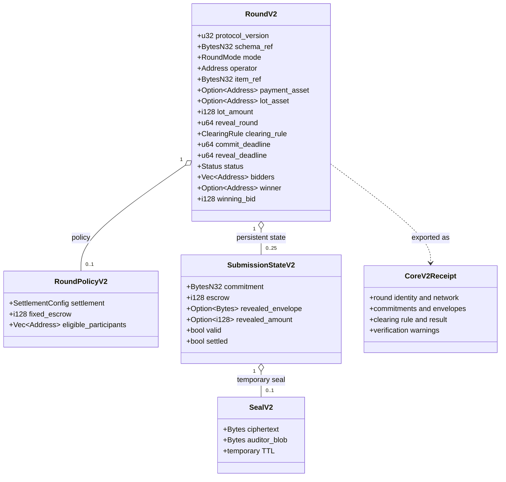
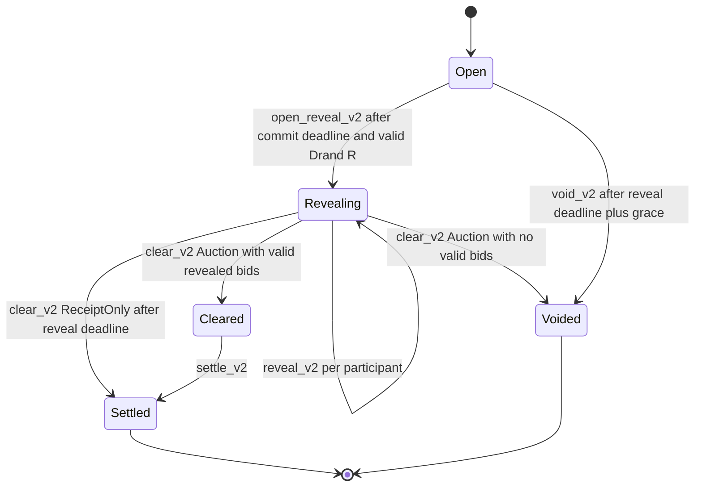
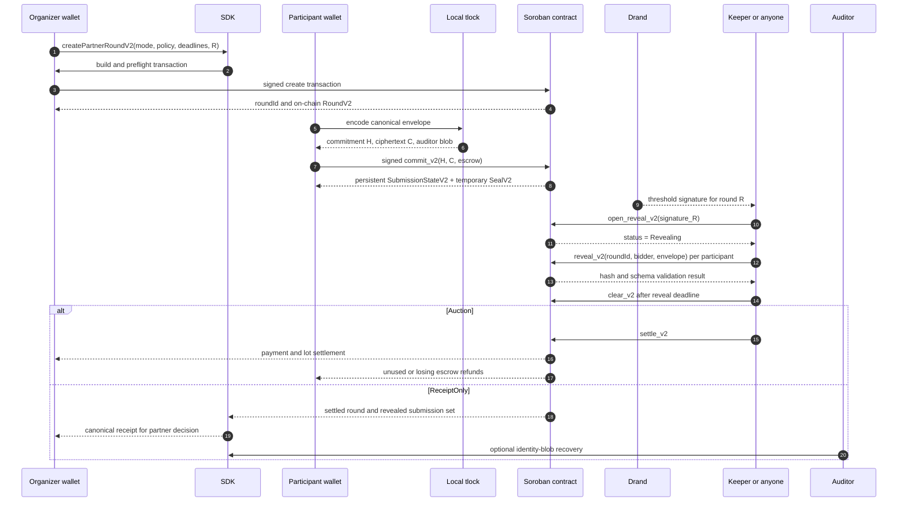
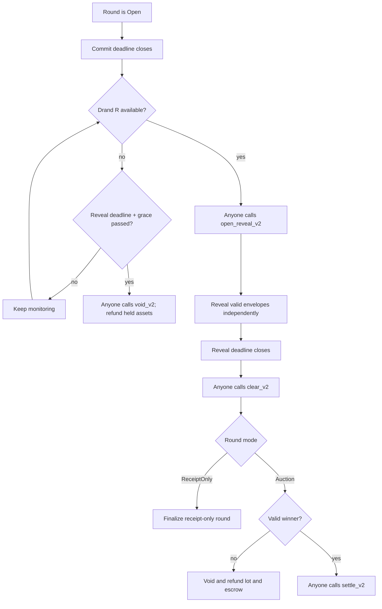
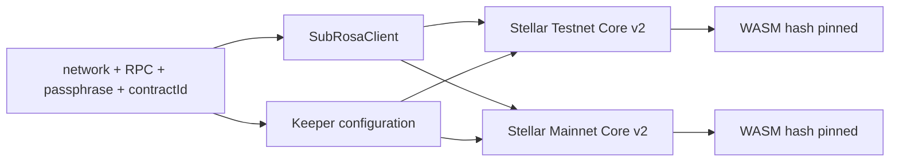
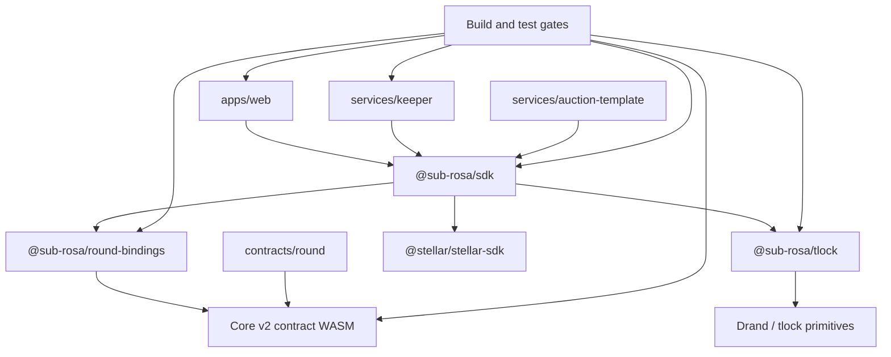

# Sub Rosa Architecture

> Sub Rosa is a sealed-market protocol that existing Stellar applications can
> embed around competitive workflows.

Core v2 has two reviewed modes:

- `Auction` combines sealed bidding with atomic Stellar asset settlement.
- `ReceiptOnly` provides confidential structured submissions and a verifiable
  reveal while leaving business selection and downstream payment with the
  partner application.

Sub Rosa deliberately does not replace partner discovery, marketplace, identity,
payment, or fulfillment systems. It owns the sealed competitive round and, only
in `Auction`, the reviewed asset settlement path.

For cryptographic and settlement detail, see
[docs/TECH_DESIGN.md](./docs/TECH_DESIGN.md). For adversaries and residual
risk, see [docs/THREAT_MODEL.md](./docs/THREAT_MODEL.md).

## 1. System position

The following diagram is the architectural boundary. The partner owns the
product workflow around the round; Sub Rosa owns confidentiality, the reveal
gate, deterministic protocol rules, receipts, and optional asset settlement.



### Boundary summary

| Boundary | Sub Rosa owns | Partner owns |
| --- | --- | --- |
| Confidential competition | Canonical payload envelope, commitment, tlock reveal gate, participant policy | Product-specific schema and participant UX |
| Timing and liveness | Drand verification, lifecycle state transitions, permissionless calls | Keeper operations, alerts, retry policy, incident response |
| `ReceiptOnly` outcome | Complete revealed set and canonical receipt | Comparing proposals, choosing a provider, downstream payment |
| `Auction` outcome | Lot custody, fixed escrow, deterministic clear, refund, atomic settlement | Asset choice, round configuration, business context |
| Network integration | Contract, SDK, bindings, network validation | Wallet, source account funding, RPC policy, application caps |

**Sub Rosa owns the sealed competitive round, not the partner's entire
workflow.** This is what lets a marketplace, RFQ tool, loan workflow, or agent
payment flow add a sealed mode without replacing its existing product logic.

## 2. Runtime topology



The same topology is used on Testnet and Mainnet. The SDK resolves a named
network to its RPC, network passphrase, and official Core v2 contract. A custom
reviewed contract can be supplied explicitly. The web application follows the
same rule through `VITE_STELLAR_NETWORK` and its deployment configuration.

The browser never sends a participant secret key to Sub Rosa services. A wallet
signs the transaction and Soroban authorization entries locally. A keeper may
hold one funded operational key, but it has no participant keys and no special
protocol authority.

## 3. Core protocol objects



### Storage classes

| Storage class | Examples | Purpose | Expiry behavior |
| --- | --- | --- | --- |
| Instance | `Config`, `RoundCounter` | Drand parameters and monotonic round IDs | Contract lifetime with TTL extension |
| Persistent | `RoundV2`, `RoundPolicyV2`, `SubmissionStateV2` | State required for clear, settlement, refunds, and receipts | Retained through completion or void according to contract retention |
| Temporary | `SealV2` ciphertext and auditor blob | Encrypted payload before and during reveal | TTL is extended when reveal opens; ciphertext can expire after the reveal window |

The complete canonical envelope is persisted in `SubmissionStateV2` after a
successful reveal. Settlement and receipt verification therefore do not depend
on temporary ciphertext still existing.

## 4. Core v2 lifecycle



| Phase | Caller | Contract behavior |
| --- | --- | --- |
| Create | Organizer or seller | Stores mode, schema, deadlines, assets, policy, and Drand round; takes lot custody for `Auction` |
| Commit | Each participant | Stores commitment, ciphertext, auditor blob, and permitted escrow; allows overwrite before the commit deadline |
| Wait | Nobody | Payload remains unreadable before Drand round `R` |
| Open | Anyone | Verifies the round-`R` BLS12-381 signature and opens the reveal phase |
| Reveal | Anyone | Submits each decrypted canonical envelope; contract checks its hash and mode-specific validity |
| Clear | Anyone | `Auction` computes the deterministic protocol winner; `ReceiptOnly` finalizes the revealed submission set without making the partner's business decision |
| Settle | Anyone | `Auction` transfers the winning payment and lot, then refunds unused and losing escrow; `ReceiptOnly` is already complete after `clear_v2` |
| Void or refund | Anyone | `void_v2` refunds an open round after the grace period; `clear_v2` voids and refunds an `Auction` with no valid winner |

The operator configures a round but has no early-decryption privilege and no
exclusive right to advance the lifecycle. Reveal operations are intentionally
separate transactions rather than one unbounded atomic reveal-all call. A
keeper retries each participant independently, so one malformed submission does
not prevent valid submissions from being recorded.

## 5. Partner boundary and integration paths

```text
Partner product boundary
--------------------------------------------------------------
Discovery / marketplace / RFQ / loan request
        |
        v
Sub Rosa Core v2: sealed submissions + deadline + reveal + receipt
        |
        +--> ReceiptOnly: partner compares terms and chooses a provider
        |
        +--> Auction: contract clears and settles the configured asset swap
        v
Partner-owned continuation
--------------------------------------------------------------
Payment, escrow outside the round, identity, reputation, fulfillment,
notifications, and the final business workflow
```

The partner can add this as an optional sealed mode inside an existing product:

| Integration path | Partner code change | Best use |
| --- | --- | --- |
| Hosted pilot | None or a link | First validation, design review, and demo evidence |
| SDK template | Small TypeScript integration | Optional sealed mode inside an existing product |
| Low-level bindings | Advanced | Custom monitoring, indexing, or operations around reviewed modes |

The hosted The Signal-style pilot is intentionally standalone: no The Signal
database, production-code change, escrow, or automatic partner selection is
required. It demonstrates OTC and loan rooms using `ReceiptOnly`; the organizer
chooses the winner after the receipt is revealed.

## 6. Component responsibilities

### Core protocol components

| Path | Responsibility | Does not do |
| --- | --- | --- |
| `contracts/round/` | Soroban state machine, Drand verification, commitments, custody, deterministic clear, settlement, refunds, and void | Identity, KYC, business selection for `ReceiptOnly`, or arbitrary settlement callbacks |
| `packages/tlock/` | Canonical envelope encoding, timelock sealing/opening, and auditor identity encryption | Wallet signing or network submission |
| `packages/round-bindings/` | Generated TypeScript client and spec-accurate contract types | Hand-authored protocol behavior |
| `packages/sdk/` | Network resolution, wallet/secret-key client, partner templates, preflight, receipts, and read helpers | Subsidizing fees or making an unknown deployment trustworthy |
| `services/keeper/` | Permissionless open, per-participant reveal, clear, settle, retry suppression, and status API | Participant decryption before `R`, winner override, or participant keys |
| `apps/web/` | Hosted pilot, docs, public round views, receipts, and wallet UX | Custody of user secrets or partner production integration |

### Reference and experimental components

These are useful integration proofs, but are not required by the Core v2
contract or by the minimum SDK adoption path.

| Path | Role | Boundary |
| --- | --- | --- |
| `services/auction-template/` | Reference native SDK integration | Demonstrates one partner-owned auction application |
| `services/agent/` | Autonomous bidder and mandate-cap proof | Mandate limits are off-chain and not Soroban-enforced |
| `services/appraisal-api/` | Optional x402 appraisal proof | Pricing and payment policy are outside Core v2 settlement |

Keeping these proofs separate prevents the core architecture from implying that
Sub Rosa is an agent platform, appraisal provider, marketplace, or payment
network.

## 7. Cryptographic and data flow



### Payload envelope

Core v2 binds the complete structured submission, not only a numeric bid. The
domain-separated envelope includes:

- envelope version;
- schema identifier;
- optional amount;
- nonce;
- application payload bytes.

The contract rejects unsupported versions, malformed payloads, and oversized
application data. SDK templates own schema-specific encoding so partner
applications do not construct envelope bytes manually.

The commitment is the SHA-256 digest of the canonical envelope. The ciphertext
is tlock-encrypted to Drand round `R`. The auditor blob is encrypted separately
with X25519 ECDH, HKDF-SHA256, and XChaCha20-Poly1305; it selectively reveals
identity without giving the auditor the application payload before `R`.

### Auction settlement

`Auction` uses two SEP-41 Stellar Asset Contracts:

```text
seller lot ---------------------> Round contract ---------------------> winner
winner fixed escrow ------------> Round contract -> winning payment ----> seller
loser escrow -------------------> Round contract ---------------------> each loser
winner unused escrow -----------> Round contract ---------------------> winner
```

The contract does not depend on an external settlement adapter for this reviewed
Auction path. If the round is voided or has no valid winner, tested refund rules
return the lot and escrow instead. `ReceiptOnly` rejects non-zero escrow and
never invokes asset transfers.

## 8. Trust boundaries

| Actor or component | Trusted for | Not trusted for |
| --- | --- | --- |
| Round contract | Commitments, custody, participant policy, timing gates, clear, settlement, refunds, and void | Off-chain business decisions or unaudited extensions |
| Drand | Publishing the future threshold signature for `R` | Application liveness if nobody submits lifecycle calls |
| Organizer or seller | Round configuration, item reference, lot custody authorization | Early payload access or discretionary settlement after protocol rules |
| Participant wallet | Authorizing its own commit and fee payment | Protecting its own device if compromised |
| Keeper | Timely lifecycle execution and retry handling | Early decryption, winner changes, or participant authorization |
| Auditor | Selective recovery of identities from auditor blobs | Reading sealed application payloads before `R` |
| Partner application | Discovery, UX, ReceiptOnly business selection, and downstream workflow | Rewriting canonical on-chain state or bypassing contract validation |
| Stellar RPC / explorer | Transaction transport and public reads | Correctness beyond what the network and contract verify |
| Optional relayer | Delivery and possible fee sponsorship | Changing contract authorization or settlement rules |

Full adversary analysis and residual risk are maintained in
[docs/THREAT_MODEL.md](./docs/THREAT_MODEL.md).

## 9. Operational safety and failure handling



The keeper is an availability service, not a trust anchor. Production pilots
should monitor:

- RPC health and transaction finality;
- Drand round arrival relative to `commit_deadline` and `reveal_deadline`;
- incomplete reveal counts and retry failures;
- settlement guard state and duplicate submissions;
- receipt export and independent verification.

The protocol intentionally does not claim atomic reveal-all. Each participant's
reveal is bounded and retry-safe. A malformed payload is rejected without
preventing other valid reveals from being persisted. If no valid Auction bid
remains, the contract voids and refunds the round.

## 10. Network and deployment topology



Named SDK presets currently resolve to:

| Network | Core v2 contract | Meaning |
| --- | --- | --- |
| Testnet | [`CCOVGOQQZJKZ2R55GRWBLTJTGBAMSHXZVN3ICPG3WRVMLMM6RHISC5OV`](https://stellar.expert/explorer/testnet/contract/CCOVGOQQZJKZ2R55GRWBLTJTGBAMSHXZVN3ICPG3WRVMLMM6RHISC5OV) | Settled `ReceiptOnly` round 2 and atomic `Auction` round 3 proofs |
| Mainnet | [`CDQOFNCJE5Z4ZZL76DU5652FOUKJVEIZWHFGCZVWH63UYBGPSZIPC325`](https://stellar.expert/explorer/public/contract/CDQOFNCJE5Z4ZZL76DU5652FOUKJVEIZWHFGCZVWH63UYBGPSZIPC325) | Canonical Core v2 deployment; explicit caps and operational controls required |
| Mainnet, historical | [`CA7KSDEYJEPGZEB2ZROTLUWKQQ6GIRIQNGG6Z745MZ34QHP4UJPWODEX`](https://stellar.expert/explorer/public/contract/CA7KSDEYJEPGZEB2ZROTLUWKQQ6GIRIQNGG6Z745MZ34QHP4UJPWODEX) | Legacy v1 native-XLM settlement smoke; not a Core v2 default |

Both Core v2 deployments use reviewed WASM hash
`2c7bc6b4c91940ac185df38a3d0a8532b555140d818df94f03f894e5952ebf42`.

The SDK validates the configured RPC network passphrase and contract existence
before simulation, signing, or submission. Contract IDs do not encode a
network, so copying an address between Testnet and Mainnet without changing
the full configuration is rejected. The transaction source that signs a write
pays its Stellar fee; escrow is separate from network fees.

## 11. Package and repository graph



| Path | Responsibility |
| --- | --- |
| `contracts/round/` | Soroban state machine, Drand verification, custody, clear, settlement, refunds, and void |
| `packages/tlock/` | Canonical payload encoding, timelock seal/open, and auditor encryption |
| `packages/round-bindings/` | Generated TypeScript contract client and spec-accurate types |
| `packages/sdk/` | Network resolution, client, partner templates, preflight, receipts, and read helpers |
| `services/keeper/` | Permissionless lifecycle automation, retries, settlement guard, and status API |
| `apps/web/` | Hosted pilot, docs, public round views, and wallet UX |
| `services/auction-template/` | Reference partner integration using the public SDK |

Reference and experimental proofs are intentionally outside the Core v2 path:

| Path | Role | Core dependency |
| --- | --- | --- |
| `services/agent/` | Autonomous bidder and mandate-cap proof | Optional; mandate caps remain off-chain |
| `services/appraisal-api/` | Optional x402 appraisal proof | Optional; pricing and payment policy remain partner-owned |

Generated bindings are never hand-edited. CI rebuilds the contract bindings and
checks that the generated output matches the reviewed WASM.

## 12. Design invariants

These are the properties the implementation and tests are intended to preserve:

| Invariant | Enforcement |
| --- | --- |
| Commit closes before Drand can reveal | Contract requires `commit_deadline < time(R)` |
| Reveal cannot start without authentic Drand output | On-chain BLS12-381 verification in `open_reveal_v2` |
| A payload cannot change after commit | SHA-256 commitment over the complete canonical envelope |
| Auction bid cannot exceed public escrow | `reveal_v2` rejects `amount > escrow` |
| Partner Auction escrow is uniform | `fixed_escrow` policy checked by `commit_v2` |
| ReceiptOnly cannot move assets | Creation rejects asset config and commit rejects non-zero escrow |
| Participant cohort remains bounded | Core v2 maximum of 25 participants |
| Settlement cannot double-pay | Per-submission `settled` flags and terminal round status |
| Missed Drand does not trap escrow forever | Grace-period `void_v2` path |
| Legacy v1 is not silently used as Core v2 | SDK and web reject the known legacy mainnet address |

## Related documentation

| Document | Focus |
| --- | --- |
| [README.md](./README.md) | Product scope, live links, SDK quickstart, and verified artifacts |
| [docs/INTEGRATION.md](./docs/INTEGRATION.md) | SDK templates, preflight, keeper, and partner flow |
| [docs/TECH_DESIGN.md](./docs/TECH_DESIGN.md) | Cryptography, storage, and settlement details |
| [docs/THREAT_MODEL.md](./docs/THREAT_MODEL.md) | Adversaries, mitigations, and residual risks |
| [docs/RECEIPTS.md](./docs/RECEIPTS.md) | Receipt schema and verification limits |
| [docs/DEPLOY.md](./docs/DEPLOY.md) | Runtime configuration, secrets, and deploy gates |
| [docs/LIMITATIONS.md](./docs/LIMITATIONS.md) | Current production boundary |
